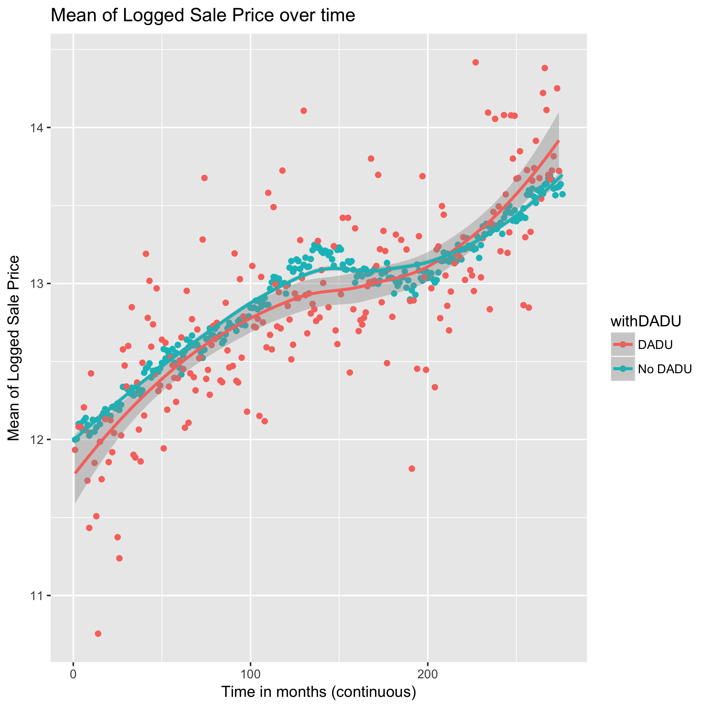

# Findings

One of the first objectives of this project was to understand the historical landscape surrounding ADU construction, including characterizing the neighborhoods and parcels in which ADUs had previously been built as well as the effects that building ADUs have on the market value and assessed value of the parcel.  This information is crucial in determining how and to whom the ADUniverse web application ought to be marketed.  The analysis is also instrumental in terms of highlighting measures that need to be taken by the city to supplement the informational capacities of the app, which includes creating partnerships with other city agencies engaged in housing affordability work, pursuing city subsidies to encourage ADU construction, and generating supplemental informational resources targeted to specific use cases.

Value-added analysis of parcels with and without ADUs was carried out using sale price and assessed value data from the King County Assessor’s office regarding single-family zoned parcels in Seattle between 1996 (the recorded ADU home sale) and 2018 (the last complete data cycle).  Preliminary descriptive analysis, illustrated by Figure [X] suggests that the value (both market and assessed) homes with attached and detached ADUs mirror (if not slightly exceeds) those  without.

Hedonic panel regression, controlling for all measured marketable housing criteria (i.e. home and lot square footage, bedrooms, building condition and age) reveals that these trends are only very recent.  There appears to be no statistically significant difference in sale price or assessed value between parcels with DADU and comparable parcels without until 2016.  The recent increases in value over comparables has abated slightly in the intervening years, but between 2017 and the present, home owners can expect to see an approximate 12-15% increase in the market value of their home.  These trends are illustrated in Figure [X] below:

The average values illustrated in the figures above, however, mask considerable heterogeneity in housing characteristics, all of which come to bear on the market and assessed value of the home.  Controlling for this heterogeneity, we find that attached ADUs are negatively associated with both market and assessed value relative to comparable homes.  Although the value gap has closed over time and continues to close, there is still a sizeable difference.   

Taken together, these findings indicate a continuing increase in the desirability of AADUs and DADUs for potential buyers, but they also suggest that interventions may be needed in order to more accurately approximate the value added to a parcel through ADU construction.  Qualitative evidence, for instance, points to the fact that neither private home appraisers nor county assessors have the frameworks or capacities to value ADUs.  Increasing communication and collaboration between Seattle Department of Planning and Community Development and the King County Assessor’s office to better quantify ADU value may ameliorate these issues and increase the profitability of ADU for the homeowners.

The four primary criteria we evaluated against a land parcel being eligible for a detached ADU were lot size, lot coverage, shore line conflicts, and neighborhood zoning. A parcel is preliminarily found ineligible if the lot size is not large enough, the lot coverage percentage is too high, it is too close to a shoreline, or the parcel is outside of single family zoning.
In regards to determining the most likely regulatory hinderances to ADU proliferation at the neighborhood level, our analysis revealed that parcel lot size is the leading concern. There was not as significant of an impact by shoreline conflicts as initially expected. In fact, it was not the leading concern for any neighborhood. 

# Deliverables

_What artifacts or outputs did you produce?_

We created a user tool to be used by potential homeowners as well as by advocacy groups and those supporting homeowners to help identify the physical and financial feasibility of building an ADU. There are several tabs in the tool: a Map tool for physical feasibilty along with potential advantages (such as proximity to frequent transit or ??) and potential hurdles (such as lots on side sewers or ECAs for that particular parcel. This tool also identifies (on the map) others in that area who own an ADU. The next tab is the Financial Feasibilty tool. This tool walks the user through the cost of building an ADU based on the size of the potential ADU, and allows them to explore loan options for construction. Finally, based on Zillow data, it provides an estimated income if the homeowner chose to rent out the ADU. Based on the user’s inputs, we plan to implement functionality to suggest city-supported loan options and low-income renter voucher options to the homeowner. We then have a FAQ tab for the homeowner to be provided with landlord resources along with links to search for their homeowner association, as well as contacts for the architects’ association and other city of Seattle contacts for questions and next steps (??). The transparency page lists the means to produce this tool and identifies gaps in the work and features that we hope to add in the future. The Analysis page, through Tableau Public, provides access to city-wide neighborhood-by-neighborhood analysis. It is divided into two sections providing links to analytical views. The first is for the use of the homeowner for a sense of Seattle-wide status quo regarding ADU construction. The second is for the use of city planner or policymaker to understand where to target outreach to homeowners to encourage construction. This user tool neatly packages almost all analysis we have done so far for this project.

_How will these deliverables be used?_

We will transfer our code (available on GitHub) to the Seattle IT Department. They will then decide how to use or implement this work towards a city government website tool. The policy-use analysis will be separated and sent to City Planning Department for their use. 

# Outcomes

How have your stakeholders responded to your deliverables? 
What impact has your project had, or do you anticipate it having? 

The City of Seattle's planning commission will look to our prototype application as a model for the tool they intend to develop. The research and analysis will aid the Seattle government in determining the most effective strategy for making ADUs a viable solution to the city's growing affordable housing crisis. 

The tool, intended for educational and advocacy purposes, will play a key role in advancing the awareness of ADUs to the population. It will also serve prospective ADU owners by providing a high-level view of the process from construction to landlordship, their parcel eligiblity, and a sense of how popular ADUs are in their neighborhood. As the final version of the tool takes shape, it will be a platform for the city to communicate policy initiatives, clarify housing code concerns, and help ADU renters navigate their landlord responsibilities.

Our immediate and extended stakeholders have expressed a high degree of interest in the application we have developed. The current outlook is that this will be an important first step on impacting neighborhood density via ADUs to increase housing affordability in Seattle. If the strategy proves effective, future iterations of the tool and the analysis results may serve other cities as a model framework to employ similar measures.
